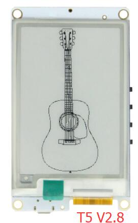

## Install the following dependency library files:
- [GxEPD](https://github.com/ZinggJM/GxEPD)
- [Button2](https://github.com/lewisxhe/Button2)
- [Adafruit-GFX-Library](https://github.com/adafruit/Adafruit-GFX-Library)
- [ESP8266Audio](https://github.com/earlephilhower/ESP8266Audio)
- [ESP8266_Spiram](https://github.com/Gianbacchio/ESP8266_Spiram)

