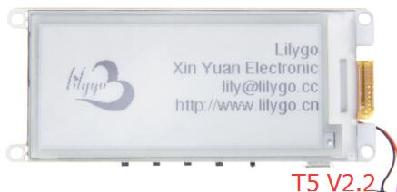

English | [中文](docs/details_cn.md) 

### This is LilyGo's ink screen series, the simplest hardware test code repository. Before coding, please read the README carefully

1. You need to install GxEPD [Please click here](https://github.com/ZinggJM/GxEPD)
2. Select `ESP32 Dev Module` in the development board, keep other options as default
3. If you do not find the ESP32 series in the development board, then you should see the installation method below [click here](https://github.com/espressif/arduino-esp32/blob/master/docs/arduino-ide/boards_manager.md)
4. Regarding the version of the board you purchased, please check the link below. Don't be fooled by the version number. Although it is incremented by numbers, they are completely different boards. If you are not sure, please click the link below to view
    - [LilyGo T5 V2.2](https://www.aliexpress.com/item/32850386996.html)
    - [LilyGo T5 V2.3](https://www.aliexpress.com/item/32869729970.html)
    - [LilyGo T5 V2.4](https://www.aliexpress.com/item/32859425947.html)
    - [LilyGo T5 V2.8](https://www.aliexpress.com/item/32867880658.html)

